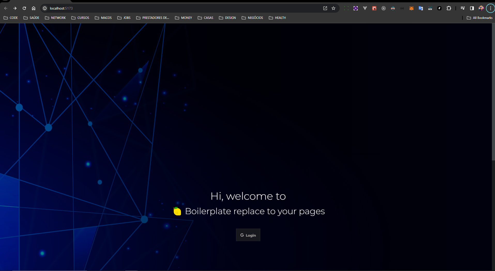

<h1 align="center">Welcome to react-todo-list-hooks 👋</h1>
<p>
  

  <a href="#" target="_blank">
    
  </a>

  <a href="https://twitter.com/anderson.lima.dev" target="_blank">
    
  </a>

  <br />
  
 
 
 
 
 
 


> Boilerplate : PWA project using vite, react, context Api, jest and firebase

## Using

Clone this repository and change origin

Or use has template

// print template

customize pages how do you need!

## Features:


## Install

```sh
npm install
```

## Run

```sh
npm run dev

```

Open link in favorite your browser:
[http://localhost:5173](http://localhost:5173/)
### ✨ [Demo](ttp://localhost:5173/)


## Run tests

```sh
npm run test
```

## Technologies and strategies:
[vite](https://vitejs.dev/)
[react](https://react.dev/learn)
[context api](https://react.dev/reference/react/useContext)
[typescript](https://www.typescriptlang.org/docs/)
[firebase](https://firebase.google.com/docs)
[jest](https://jestjs.io/docs/getting-started)
[pwa](https://developer.mozilla.org/en-US/docs/Web/Progressive_web_apps)

## Author

👤 **Anderson Lima**

- Website: https://lemondev.framer.ai
- Twitter: [@andersonlimahw](https://twitter.com/andersonlimahw)
- Github: [@andersonlimahw](https://github.com/andersonlimahw)
- LinkedIn: [@andersonlimahw](https://linkedin.com/in/andersonlimahw)
